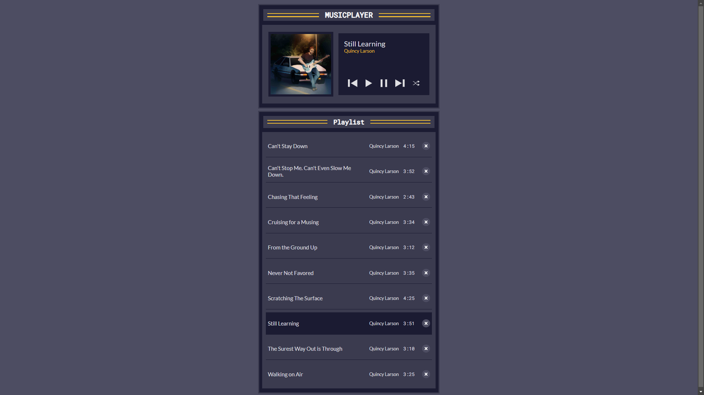

# Music Player

Este é um projeto de Music Player desenvolvido com JavaScript Vanilla, HTML e CSS. O player permite que você toque músicas, pause, avance para a próxima faixa e volte para a faixa anterior. Além disso, você pode embaralhar a lista de reprodução e remover músicas.

## Funcionalidades

- **Reprodução de Música**: Ao clicar no botão de play, a música começa a tocar.
- **Pausa de Música**: O botão de pause interrompe a reprodução da música.
- **Próxima Faixa**: Avance para a próxima música da lista.
- **Faixa Anterior**: Retorne para a música anterior na lista.
- **Embaralhamento**: Embaralhe a lista de músicas para uma experiência aleatória.
- **Remover Música**: Remova uma música da lista de reprodução.

## Como Funciona

1. **Interface do Usuário**: A interface é construída com HTML e estilizada com CSS. A lista de músicas é exibida com informações como título, artista e duração.
2. **Controle de Música**: A lógica para tocar, pausar e navegar pelas músicas é gerida através de funções JavaScript.
3. **Listas de Reprodução**: As músicas são armazenadas em um array e exibidas na interface. Ao clicar no botão de play de uma música específica, ela começa a tocar.

## O que Aprendi

- Como manipular o DOM usando JavaScript para criar uma interface de player de música interativa.
- A implementação de funcionalidades de reprodução de áudio utilizando a API `Audio`.
- O gerenciamento do estado do player para lidar com a reprodução, pausa e navegação entre as músicas.
- Como trabalhar com eventos de clique e como gerenciar a lista de reprodução dinamicamente.

## Como Usar

1. Clone o repositório ou faça o download dos arquivos.
2. Abra o arquivo HTML em um navegador.
3. Clique no botão de play para começar a ouvir a música!

## Contribuições

Sinta-se à vontade para contribuir para o projeto ou sugerir melhorias!

